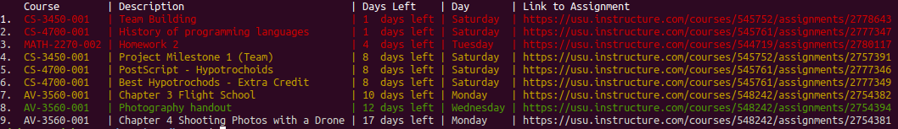

# Python wrapper to see assignments

## Example output

Prints to console currently assigned homework.

Displays: class name, assignment name, days left till due date, day of the week and link to the assignment's page 

# Installation
1. Run the following commands after cloning the repo

        cd Homework
        chmod +x install/install.sh
        ./install/install.sh

# Example bash script to run in terminal

1. Create directory .scripts in home directory.

2. Add the following to your .bashrc file

        export PATH=$PATH:~/.scripts

3. Create the command you want to run

        cd ~/.scripts
        touch hw
        chmod +x hw

4. Edit hw file and add

        !/bin/bash
        python3.6 path/to/source/hw.py $1
